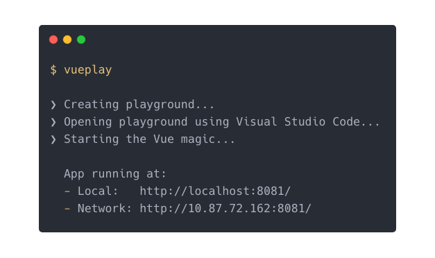

# vueplay

*vueplay* allows you to get a Vue playground up an running in seconds.

<p align="center">
  
</p>

**Run** *vueplay* and this happens:
- A simple *Vue* project is created (in a **temporary and unique** director).
- The project opens in Visual Studio Codes.
- Vue is told to serve the project.


## Installation

```console
$ npm i -g @vue/cli-service-global
$ npm i -g @ckienle/vueplay
```

*vueplay* requires `@vue/cli-service-global` to be installed globally. Otherwise it will not work.

## Running

```console
$ vueplay
```

## Current State

*vueplay* is currently tailored to **my personal** needs. This means that there is not way to configure *vueplay* in any way. Running *vueplay* gives you:

- A very simple Vue project in a **temporary & unique** directory with the following files:
  - `App.vue`: Entry point of the whole playground.
  - `HelloWorld.vue`: A simple component which is used by `App.vue`.
  - `package.json`: Simply contains a `start`-script which runs `vue serve App.vue`
  - `.vscode/`: A Visual Studio Code configuration with a simple *Run*-action.
- After the playground has been created *vueplay* automatically
  - launches `vue serve App.vue` and
  - opens the playground in Visual Studio Code
